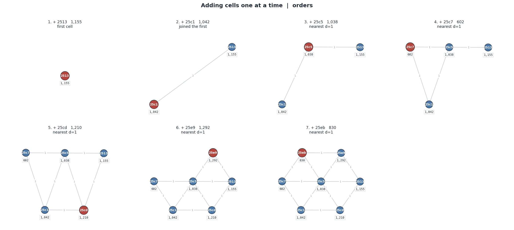
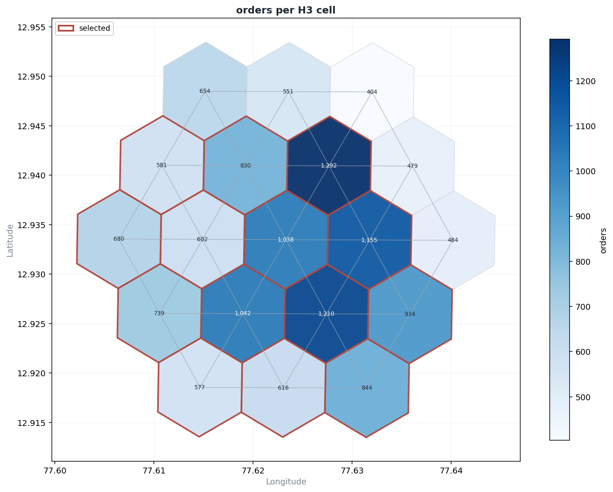

# sameer-graph-lib

`sameer-graph-lib` is an editable Python library for building H3-based route affinity graphs with NetworkX.

It turns H3 arrays, latitude/longitude sequences, and encoded polylines into connected hex chains, inserts them into a weighted graph, extracts high-affinity corridors, and decomposes the graph into a main trunk plus minor branches.

## Editable install

```powershell
python -m pip install -e ".[dev,plot]"
```

Because the install is editable, changes you make inside `src/sameer_graph_lib` are picked up immediately by Python without reinstalling.

If your machine uses `uv`, run commands through the managed environment:

```powershell
uv run --extra dev --extra plot python -c "import sameer_graph_lib; print(sameer_graph_lib.__version__)"
```

## Install

From PyPI after publication:

```powershell
pip install sameer-graph-lib
```

With optional plotting and geospatial extras:

```powershell
pip install "sameer-graph-lib[plot,geo]"
```

For the route flow graph and the DataFrame plotter (pandas, numpy, xarray, matplotlib):

```powershell
pip install "sameer-graph-lib[analysis]"
```

## Quick start

```python
from sameer_graph_lib import HexGraph

graph = HexGraph(hex_resolution=9)

route = graph.add_latlng_sequence([
    (12.9716, 77.5946),
    (12.9760, 77.5990),
])

print(graph.get_graph_stats())
selected = graph.get_appropriate_hexes(cutoff=0.8)
fig = graph.visualize_graph(title="80% compact cluster", highlight_hexes=selected)
print(graph.decompose_branches())
```

## Main APIs

- `SpatialIngestor`: converts H3 arrays, lat/lng sequences, and encoded polylines into contiguous H3 chains.
- `AffinityGraph`: NetworkX wrapper for array-based insertion, nearest attachment, affinity scoring, editing, and JSON persistence.
- `CorridorExtractor`: uses exact all-node Dijkstra selection to extract the most compact cluster covering a target percentage of graph traversal volume.
- `TopologyAnalyzer`: separates the main branch from residual minor branches.
- `HexGraph`: backwards-compatible convenience class for your original code style.
- `RouteSchema` / `RouteTensor` / `RouteGraph`: grain-aware pickup -> drop graph where each edge carries a metric cube (see [Route flow graphs](#route-flow-graphs-pickup---drop)).
- `RouteExplorer`: the one-liner front door to the route graph - build from a DataFrame, rank partners, and plot the flow around a cluster.
- `plotter`: stateless DataFrame plotting - multi-column, multi-axis, multi-group, plus distribution checks.
- `HexMetricGraph`: a graph from one column of H3 cells, metrics on the nodes and edges from the H3 array logic (see [Hex metric graphs](#hex-metric-graphs-one-h3-column-no-routes)).

Graph creation follows the original per-node procedure: H3 arrays are normalized, then each hex is inserted with `add_node`/`add_hex`. Lat/lng sequences and encoded polylines are first converted into H3 arrays at the requested resolution, then inserted the same way.

For QC, use:

```python
fig = graph.visualize_graph(highlight_hexes=selected)
fig.savefig("graph_qc.png", dpi=150, bbox_inches="tight")

fig = graph.visualize_step_by_step(route[:5], labels=["A", "B", "C", "D", "E"])
fig.savefig("insertion_steps.png", dpi=150, bbox_inches="tight")
```

To plot actual H3 hex boundaries as geospatial polygons:

```python
from sameer_graph_lib import plot_h3_cells, plot_h3_cells_map

fig = plot_h3_cells("88618c4f29fffff", label_full_hex=True)
fig.savefig("single_h3_cell.png", dpi=150, bbox_inches="tight")

fig = graph.plot_h3_cells(highlight_hexes=selected, show_labels=False)
fig.savefig("h3_cell_footprint.png", dpi=150, bbox_inches="tight")

fig = plot_h3_cells_map(route, selected_cells=selected)
fig.savefig("h3_cell_basemap.png", dpi=150, bbox_inches="tight")
```

`plot_h3_cells_map` uses GeoPandas + Contextily. Install it with:

```powershell
python -m pip install -e ".[plot,geo]"
uv run --extra plot --extra geo python -c "from sameer_graph_lib import plot_h3_cells_map"
```

To get H3 centers and a convex hull:

```python
from sameer_graph_lib import getLatLng, h3_convex_hull

points = getLatLng(route)          # [(lat, lng), ...]
hull = h3_convex_hull(route)       # Shapely geometry in (lng, lat)
graph_hull = graph.convex_hull()   # Same, using graph nodes
```

## Route flow graphs (pickup -> drop)

The second half of the library works on tabular route data rather than H3
chains: one row per `pickup_cluster x drop_cluster x week_period x hour`, with
whatever metric columns you export. Every edge stores a **tensor** - a dense
cube over the grain dimensions - so sums stay exact, averages stay correctly
weighted, and two tensors can be merged without re-reading the source rows.

The metric columns are **yours**: the schema reads whatever numeric columns the
frame has. Names that look like averages (`avg_`, `_rate`, `pct`, `ratio`, ...)
are weighted-averaged, the rest are summed, and grain/id/categorical columns are
never treated as metrics. Pass `sum_metrics=` / `mean_metrics=` to override the
split, and `metric=` anywhere to choose the variable; with nothing named, calls
fall back to `schema.default_metric` (the first sum metric).

Install the extra:

```powershell
python -m pip install -e ".[analysis]"      # pandas, numpy, xarray, matplotlib
```

### Naming your columns

Nothing is assumed about your column names. `preview` reads the frame and
proposes a role for every column; `ask` shows the same proposal and lets you
correct it before the graph is built:

```python
print(RouteExplorer.preview(df))
```

```text
column           dtype       levels  role
pickup_cluster   str             15  pickup id
week_period      str              2  grain
hour             int64           24  grain
orders           float64        833  metric
avg_distance     float64        833  metric (distance)
avg_duration     float64        833  metric (duration)
```

```python
ex = RouteExplorer.ask(df)     # prompts, with the proposal pre-filled
```

It asks for the pickup and drop ids, the grain columns, the metric columns, and
which two metrics are the distance and the duration that `speed` divides.
Answers can be column names or the numbers it lists; blank accepts the
proposal and `none` clears it. Outside an interactive session the proposal is
used unchanged, so scripts and saved notebooks still run.

To skip the questions, name everything yourself (grains are optional - leave
`grain_cols` out entirely if you do not want any):

```python
ex = RouteExplorer(
    df,
    pickup_col="origin_zone",
    drop_col="dest_zone",
    grain_cols=("day_part", "time_slot"),
    metrics=["trips", "bookings", "avg_km", "avg_mins"],
    length_metric="avg_km",        # speed is distance over time, so the
    ride_time_metric="avg_mins",   # schema has to know which is which
)
```

`metrics=` is a subset - only those columns are taken. Without it, every
numeric column that is not a grain or an id becomes a metric. If you leave
`length_metric`/`ride_time_metric` unset on data that does not use the default
names, `speed` is NaN rather than wrong.

### Quick start

```python
from sameer_graph_lib import RouteExplorer

ex = RouteExplorer(df, metric="orders")   # metric= is optional

ex.sources("A1", top=5)     # where A1 orders come from
ex.drops("A1", top=5)       # where A1 orders go
ex.route("A1", "B1")        # every metric for one route
ex.summary("A1")            # every metric for one cluster
print(ex.describe())
```

`where` and `using` return a new view that shares the same graph, so you can
narrow the question without rebuilding anything:

```python
peak = ex.where(week_period="weekday", hour=[8, 9, 10]).using("speed")
peak.drops("A1", top=5)
```

### Plotting the flow around a cluster

`plot` puts the focus clusters in the middle, the clusters that feed them on
the left, and the clusters they feed on the right. The per-level top-k is the
main control: pass an int for one level, or a list for one number per level.

```python
# top 5 sources, then the top 3 sources of each of those, then the top 2;
# and on the other side, the top 4 drops and the top 2 of each.
fig = ex.plot("A1", upstream=[5, 3, 2], downstream=[4, 2])

# several focus clusters, plus the routes between the selected set
ex.plot(["A1", "C1"], upstream=3, downstream=3, include_cross_edges=True)

# rank by one variable, show several: every node and edge carries a table
ex.plot("A1", metric="orders",
        node_metrics=["orders", "accepted_orders", "requests", "speed"],
        edge_metrics=["orders", "speed", "avg_distance"],
        hour=[8, 9, 10])
```

`node_metrics` and `edge_metrics` take any number of variables. They are drawn
as a small aligned table under each node and on each edge, with the metric
names on the left and the values right-aligned; every table in one figure
shares its column widths, and the figure sizes itself so they do not collide.
Numbers are formatted per value by default (62,709 and 0.273 both read
correctly); pass `value_format="{:,.1f}"` for one format, or a dict such as
`value_format={"speed": "{:.3f}"}` per metric.

The number in a node table is that cluster **as a pickup**: the orders it sends
out, across all of its routes. `node_direction="in"` switches to what it
receives and `"both"` to the sum of the two. A cluster with no outbound routes
shows `n/a` rather than `0`, since it never appears as a pickup.

Useful options: `per_parent=False` (rank a whole level globally instead of per
parent)

Other options: `size_metric=` (which variable drives node size),
`show_metric_names=False` (values only), `per_parent=False` (rank a whole level
globally instead of per parent), `min_value=`, `layout="layered" | "geo" |
"spring"` (`geo` places H3 cluster ids at their real coordinates),
`show_edge_values`, `label_cross_edges`, `curve`, `figsize`, and the colours.

The same expansion is available without plotting:

```python
ex.flow("A1", upstream=[5, 3], downstream=4)       # tidy DataFrame
ex.subgraph("A1", upstream=2, downstream=2)        # nx.DiGraph, levels on nodes
print(ex.tree("A1", upstream=[5, 3], downstream=4))
```

```text
A1  (orders)
  sources (orders coming in)
  |-- <- C1  [8,523.4]
  |   |-- <- D3  [8,802.4]
  |   +-- <- D2  [3,646.5]
  +-- <- C3  [7,041.1]
  drops (orders going out)
  |-- -> B4  [4,574.9]
  +-- -> B5  [4,446.4]
```

### Filtering

Top-k and filtering are different things. `upstream`/`downstream` **rank** on
one metric and keep the best few per hop; a filter is an **absolute test** on
any metric, and anything failing it is gone regardless of rank.

`keep()` returns a new graph, `cut()` removes from the one you have:

```python
fast  = ex.keep(edge_filter={"speed": (">", 0.25)})     # new graph, original untouched
busy  = ex.keep(node_filter={"orders": 5_000})          # drops the cluster and its routes
ex.cut(edge_filter={"orders": ("<", 100)})              # prunes in place, chainable
```

A test is a number (`>=`), an `(operator, value)` pair (`>`, `>=`, `<`, `<=`,
`==`, `!=`) or a `(low, high)` range. Several metrics are combined with AND, and
a metric that is NaN never passes:

```python
ex.keep(edge_filter={"orders": 500, "speed": (0.2, 0.6), "unfulfilled": ("<", 5)})
```

Filters honour the sticky grain, so `ex.where(hour=[8, 9]).keep(...)` tests the
morning numbers only. `matching_routes()` and `matching_clusters()` preview what
a filter would accept without changing anything.

Plots and expansions take the same arguments, applied *before* walking, so the
top-k at each hop is chosen from the survivors:

```python
ex.plot("A1", upstream=[5, 3], edge_filter={"speed": (">", 0.25)})
ex.flow("A1", upstream=5, node_filter={"orders": 1_000})
```

### Reachability and paths

Filtering asks *is this route good enough*; reachability asks *can I get there
at all, and at what cost*. The cost is accumulated along the path, so a two
hour limit is a budget on the ride-time metric:

```python
ex.reach_to("A1", budget=120)          # who can reach A1 within 2 hours
ex.reach_from("A1", budget=120)        # where can I get from A1 in 2 hours
```

```text
cluster  avg_duration  hops            path
     C2          30.0     1        C2 -> A1
     C1          50.0     1        C1 -> A1
     D1          90.0     2  D1 -> C1 -> A1
```

Three constraints compose, and each does a different job:

| | caps | a cluster is excluded when |
| --- | --- | --- |
| `budget` | the **accumulated** cost along the path | the whole trip is too dear |
| `max_hops` / `min_hops` | the **length** of the path | it needs too many legs |
| `edge_filter` / `node_filter` | **each hop** | a leg on the way fails the test |

They are genuinely independent: with a generous budget a cluster can still be
cut for needing four legs, and a nearby cluster can be cut because the only leg
into it carries too few orders. The search is a Dijkstra over `(cluster, hops)`
states, so a cheap-but-long route never hides a dearer one that fits the hop
cap.

```python
ex.reach_to("A1", budget=120, max_hops=2)                      # and at most 2 legs
ex.reach_to("A1", budget=120, edge_filter={"orders": 100})     # only real routes
ex.reach_to("A1", budget=40, cost="avg_distance")              # distance, not time
ex.reach_to("A1", budget=120, metrics=["orders"])              # total orders en route
ex.where(hour=[8, 9, 10]).reach_to("A1", budget=120)           # morning travel times
```

`reach_to`/`reach_from` keep the cheapest way to each cluster. To compare the
alternatives instead, enumerate them:

```python
ex.paths("D1", "A1", budget=120, max_hops=3, metrics=["orders"])
ex.path_total(["D1", "C1", "A1"], "avg_duration")    # 90.0
```

And to see it rather than read it, `plot_reach` lays the result out by hop
band, with the accumulated cost in each node table:

```python
ex.plot_reach("A1", budget=120)                       # who reaches A1 in 2 hours
ex.plot_reach("A1", direction="out", budget=60)       # where A1 reaches in 1 hour
```

A leg whose cost is missing is impassable rather than free, paths are simple
(no cluster twice), and the units are whatever your data uses - `budget=120`
means 120 of them.

### Grains are optional

Pass none and the whole frame collapses into a single bucket; pass whatever you
want to slice by:

```python
ex = RouteExplorer(df)                                  # no grain at all
ex = RouteExplorer(df, grain_cols=("week_period", "hour"))
ex = RouteExplorer(df, grain_cols=("variant",))         # a test/control cohort
```

A cohort column is just another grain, so an A/B split reads the same way as a
time slice:

```python
cohort = RouteExplorer(df, grain_cols=("variant",))
cohort.where(variant="test").drops("A1", top=5)
cohort.where(variant="control").drops("A1", top=5)
```

Columns *named* for a bucket (`hour`, `week`, `slot`, `day`, `cohort`, ...) stay
out of the metrics even when you do not use them as grains, because summing an
hour column means nothing. That test is on the name only: an integer count with
few distinct values, like `cancelled` or `riders`, is still a measurement and is
kept.

### Which columns land where

```python
ex = RouteExplorer(df, metrics=["orders", "requests", "avg_km", "avg_mins"])
ex.routes_frame(metrics=["orders", "speed"])            # edge table, your columns
ex.routes_frame(metrics=["orders"], hour=[8, 9])        # and a grain window
ex.plot("A1", node_metrics=["orders", "speed"],         # tables on the picture
        edge_metrics=["orders", "unfulfilled", "speed"])
```

### Ranking by the route or by the cluster

The top-k at each hop can measure either end. Say `B1` barely feeds `A1` but is
enormous overall, while `B2` feeds `A1` hard but is small:

```python
ex.sources("A1", top=2)                    # B2, B3 - the biggest routes in
ex.sources("A1", top=2, rank_by="node")    # B1, B2 - the biggest clusters
```

`rank_by` works the same on `drops`, `flow`, `subgraph` and `plot`:

```python
ex.plot("A1", upstream=[5, 3], rank_by="node")
```

Edge width and the edge tables still show the route's own metric; the value the
ranking used is kept alongside it as `rank_value`. Use `node_direction=` to
choose whether a cluster is measured on what comes in, what goes out, or both.

### What a cluster holds, in and out

A cluster stores nothing itself - its totals come from merging the tensors of
the routes touching it. `node_split` shows both sides; only the cluster is
required, everything else is an optional keyword:

```python
ex.node_split("A1")                                   # every metric, no diff
ex.node_metrics_frame()                               # the same across the graph

ex.node_split("A1", metrics=["orders", "requests", "avg_distance"], diff=True)
```

```text
orders        in=   30.00  out=   30.00  diff=    0.00
requests      in=  400.00  out=  100.00  diff= -300.00
avg_distance  in=    3.50  out=    9.00  diff=    5.50
```

Sums are summed. Means are **weighted averages**, taken from the stored
`value x weight` and `weight` arrays, so the inbound `avg_distance` above is
`(2*100 + 4*300) / 400 = 3.50` - not `(2 + 4) / 2 = 3.00`, which would ignore
that one route carried three times the volume.

You choose the weight column when the graph is built:

```python
ex = RouteExplorer(df, weight_col="requests")     # or trips, pings, sessions...
ex.weight_col                                      # 'requests'
```

`ask()` asks for it too. It is fixed at build time because the weighting is
baked into the tensors as the rows are folded in; to weight by something else,
rebuild with a different `weight_col`.

`diff` is opt-in per metric - `True` for all of them, or a list of the ones you
want - and `diff_order="in-out"` flips the sign. Across the whole graph:

```python
ex.node_metrics_frame(metrics=["orders", "avg_distance"], diff=["orders"])
```

```text
cluster  in_routes  out_routes  in_orders  out_orders  diff_orders  in_avg_distance  out_avg_distance
      A          2           1       30.0        30.0          0.0              3.5               9.0
      C          0           1        NaN        20.0          NaN              NaN               4.0
```

A side with no routes is NaN rather than zero, so "no inbound routes at all" is
distinguishable from "inbound routes carrying nothing". Grain filters apply as
everywhere else: `ex.where(hour=[8, 9]).node_split("A1", ...)`.

### Other route views

| Call | What you get |
| --- | --- |
| `ex.plot_partners("A1", top=10)` | top sources and top drops as back-to-back bars on one shared scale |
| `ex.plot_profile(cluster="A1")` | week_period x hour heatmap for a cluster or a route |
| `ex.plot_matrix(top=15)` | pickup x drop heatmap |
| `ex.plot_graph(top_routes=30)` | the whole graph as a ranked ring, sized and coloured by a metric |
| `ex.clusters_frame()` | per cluster inbound vs outbound volume and net balance |
| `ex.top_routes(20)` | routes ranked by any metric |
| `ex.matching_routes(...)` | preview which routes a filter accepts |
| `ex.reach_to("A1", budget=120)` | clusters that can reach A1 in two hours |
| `ex.paths("D1", "A1", budget=120)` | every qualifying route between two clusters |
| `ex.matrix()` / `ex.frame()` | pivot table / long per-bucket frame |

The lower-level classes are public too: `RouteSchema` (grains and metric
columns), `RouteTensor` (one route's metric cube, with `summary`, `totals`,
`profile`, `merge`) and `RouteGraph` (the NetworkX graph, with `partners`,
`node_tensor`, `shortest_route`, `flow_subgraph`, `as_dataset`).

## Hex metric graphs (one H3 column, no routes)

The route stack needs a pickup and a drop on every row. Often you do not have
that - you have **one column of H3 cells** and the same metric columns. There is
no edge information in that data, so `HexMetricGraph` keeps the metrics on the
nodes and builds the edges the way the rest of the library already does: every
cell is inserted with `AffinityGraph.add_hex`, which attaches it to its nearest
neighbours by grid distance and reroutes as the picture fills in.

```python
from sameer_graph_lib import HexMetricGraph

hg = HexMetricGraph(df, hex_col="hexid", grain_cols=("week_period", "hour"))

hg.summary(cell)                 # every metric for one cell
hg.value(cell, "orders")         # one metric
hg.value(cell, "orders", hour=[8, 9, 10])        # inside a grain window
hg.frame()                       # one row per cell, with lat/lng
hg.top_cells("orders", 10)
hg.total_summary()               # every metric across all cells
```

### Choosing the metric columns

By default every numeric column that is not a grain or the id becomes a metric.
Pass `metrics=` to take only the ones you want:

```python
hg = HexMetricGraph(df, hex_col="hexid", metrics=["orders", "requests", "avg_distance"])
```

Names that look like averages (`avg_`, `_rate`, `pct`, ...) are weighted-averaged
and the rest are summed; pass `sum_metrics=` / `mean_metrics=` to set that split
yourself, and `value_metric=` to choose which one is written onto the node (the
one `corridor()` weights by). A column that is not numeric is rejected by name
rather than silently ignored.

### Adding hexes as you go

```python
hg.add_frame(more_rows)                       # returns the cells that were new
hg.add_cell(cell, orders=250, requests=500)   # one hex, values inline
```

A cell that already exists accumulates into its tensor; a new one is inserted
with the same topology rule the graph was built with, so the picture keeps
growing the way it started. `plot_steps` replays that insertion one panel per
cell, each labelled with its value:

```python
fig = hg.plot_steps(metric="orders")
fig.savefig("hex_metric_steps.png", dpi=140, bbox_inches="tight")

fig = hg.plot_steps(cells=hg.add_frame(new_rows))   # only the cells just added
```



Each panel shows the new hex in red with its value, the edges the attachment
logic chose, the grid distance on each edge, and what the insertion did
(`first cell`, `nearest d=1`, `rerouted 2`).

Each cell carries a metric cube exactly as a route edge does, so sums stay
exact and averages stay weighted by `requests` (or whatever `weight_col` you
set). `grain_cols=()` is fine too - with no grain, a single flat bucket is used.

### The edges

| `topology=` | what it connects |
| --- | --- |
| `"attach"` (default) | the H3 array logic: nearest existing cells by grid distance, with rerouting |
| `"adjacent"` | cells within `ring=` grid steps of each other |
| `"none"` | nothing - the cells are stored, but left unconnected |

Because the per-cell metric is written onto the node as its `value`, the
selection logic already in the library works unchanged:

```python
cells = hg.corridor(0.8)         # the compact cluster holding 80% of the volume
hg.corridor_stats(0.8)           # coverage, cell count, area in km2
hg.neighbors(cell)
hg.distance(cell_a, cell_b)      # grid steps
```

### Plots

```python
hg.plot_cells(metric="orders", highlight=hg.corridor(0.8))   # real hexagons, shaded
hg.plot_cells(metric="orders", hour=[8, 9, 10])              # one grain window
hg.plot_steps(metric="orders")                               # cells joining, one by one
hg.plot_graph()                                              # the node/edge QC view
hg.plot_profile(cell)                                        # week_period x hour
```



### One graph per group

The per-row pattern from `examples/create_pandas_row_graphs.py`, but with the
metrics kept on the cells:

```python
graphs = HexMetricGraph.per_group(df, "city", hex_col="hexid")
graphs["north"].top_cells("orders", 5)
```

Nothing in the existing modules changed for this: the schema and tensor come
from the route stack, the topology and the corridor selection from
`AffinityGraph`.

## DataFrame plotting

`sameer_graph_lib.plotter` is a stateless plotting layer for any DataFrame -
each function takes a frame and returns a figure.

```python
from sameer_graph_lib import plotter

# n columns, one panel each, test vs control overlaid in every panel
plotter.plot_columns(df, ["orders", "speed", "aor"], x="hour", group="variant",
                     agg="mean", kind="line", mode="grid")

# columns with different scales on one chart, one y-axis each
plotter.plot_multi_axis(df, ["orders", "speed"], x="hour", agg="mean")

# distribution of a column, with count/mean/median/sd/skew in the corner
plotter.plot_distribution(df, "speed", kind="hist", bins=40)

# the same distribution per group, one colour per line, on one chart
plotter.compare_distributions(df, "speed", group="variant", kind="kde", with_box=True)

# A/B readout: aggregate per group, optionally relative to a baseline
plotter.compare_groups(df, ["orders", "speed"], group="variant", agg="mean",
                       normalize_to="control")

plotter.describe_distribution(df, "speed", group="variant")   # stats table
plotter.plot_correlation(df, ["orders", "speed", "distance"])
```

`mode` is `grid` (one panel per column), `overlay` (one shared axes) or `twin`
(one y-axis per column). `kind` is `line`, `step`, `area`, `bar`, `barh`,
`scatter`, `hist`, `kde`, `box`, `violin` or `ecdf`. `group` splits every
series by a categorical column and gives each level its own colour. KDE and
ECDF are computed with numpy, so scipy is not required.

The explorer exposes the same helpers over its own long frame:

```python
ex.plot_columns(["orders", "speed"], x="hour", group="week_period", agg="mean")
ex.compare_distributions("speed", "week_period")
```

## Useful commands

```powershell
python -m pytest
python -m build
uv run --extra dev pytest -q
uv run --extra dev python -m build
uv run --extra dev python -m twine check dist/*
```

Build artifacts will appear in `dist/` after `python -m build`.

## Publish To PyPI

1. Build the package:

```powershell
uv run --extra dev python -m build
```

2. Validate the package metadata:

```powershell
uv run --extra dev python -m twine check dist/*
```

3. Upload to PyPI:

```powershell
uv run --extra dev python -m twine upload dist/*
```

After upload, users can install it with:

```powershell
pip install sameer-graph-lib
```

## Publish From GitHub

This repo also includes a Trusted Publishing workflow in
[.github/workflows/publish.yml](C:/Users/rrran/Desktop/sameer_graph_lib/.github/workflows/publish.yml:1).

To finish that setup:

1. Create the project on PyPI, or reserve the name `sameer-graph-lib`.
2. On PyPI, open the project settings and add a Trusted Publisher for:
   `owner`: `iams31`
   `repository`: `sameer_graph_lib`
   `workflow`: `publish.yml`
   `environment`: `pypi`
3. Create a GitHub Release, or run the workflow manually from the Actions tab.

After that, GitHub Actions can publish without storing a long-lived PyPI token.

Official references:

- PyPI Trusted Publishing: https://docs.pypi.org/trusted-publishers/
- Packaging guide upload flow: https://packaging.python.org/tutorials/packaging-projects/
